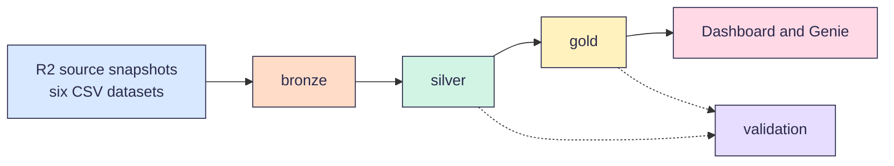

<p align="center">
  
</p>

# Infrastructure Project Monitoring

A Databricks pipeline that shows where public works money goes in the Philippines, and which places get too little.

[](https://github.com/Buildabida/infra-project-monitoring/actions/workflows/checks.yml)

Built by team Buildabida (LT2) for the FTW Foundation Data Engineering Track capstone, 2026.

> [!NOTE]
> We're building this now. Ingestion and the schema are due Oct 3. Judging is Oct 24.

## Why we built it

The government publishes its projects in many places. Each source names places and project types in its own way. So it's hard to see the full picture.

Our brief asks one main question:

> Where is government infrastructure investment concentrated, what types of projects are being funded, and which areas have relatively low investment compared with population and infrastructure needs?

In short: where does the money go, what kinds of projects get it, and which places get too little for how many people live there?

These smaller questions help us answer it:

1. How much project money went to each region and province, in total and per person?
2. Which projects are late or not moving?
3. Does the amount paid match the reported progress?
4. How do flood control projects compare with other project types?
5. Which places have many people but few projects?

## Who it's for

- **People** who want to check public works spending in their province or city
- **Planners** who want to find places with many people but few projects
- **Our mentor, support instructor and judges**, who need to run and check the pipeline

## How it works



Each layer is a schema in our `buildabida-capstone` catalog. The numbers show the run order.

| Schema | What it holds |
| --- | --- |
| `00-source` | Cloudflare R2 source snapshots exposed through a volume |
| `01-bronze` | Each source as it came, plus the load time |
| `02-silver` | Clean data. Every project gets a PSGC code, the official code for its place. |
| `03-gold` | Ready-to-use tables for the dashboard and Genie |
| `04-validation` | The result of every data quality check |

Python loads our sources into `01-bronze` and runs grouped Spark Bronze checks. The checks save their results in `04-validation`. SQL will build the planned `02-silver` and `03-gold` layers. The dashboard and Genie are not built yet.

## Quickstart

We write code in VS Code and run it on our team workspace on [Databricks Free Edition](https://www.databricks.com/learn/free-edition). Nadine adds you to the workspace, and you accept the invite by email.

1. Install VS Code with the **Databricks** and **Python** extensions.
2. Clone `https://github.com/Buildabida/infra-project-monitoring.git` and open the folder.
3. Click the **Databricks** icon, sign in with **OAuth (user to machine)** and pick **Serverless**.
4. Open `notebooks/00_setup/00_setup_workspace.sql`, click **Run on Databricks**, then **Run File as Workflow**.

The last cell lists the five schemas. Next, run `01_check_sources.py` the same way to see which sources Databricks can reach. The full steps are in [set up VS Code](docs/vscode-setup.md).

To load bronze, confirm the six configured CSVs are present in the existing `00-source`.`cloudflare-r2` volume, then run `notebooks/run_all.py`. The steps are in [load bronze](notebooks/README.md#load-bronze).

## Data sources

| Source | What we use it for |
| --- | --- |
| [DPWH projects API](https://api.dpwh.bettergov.ph/projects) by BetterGov.ph | Every DPWH project with its budget, amount paid, progress, dates, contractor and map point. About 265,000 projects as of Sep 2026. |
| [DPWH Transparency Portal](https://transparency.dpwh.gov.ph) | The official source. We use it to spot-check the API. |
| [Sumbong sa Pangulo](https://sumbongsapangulo.ph) | Flood control projects, from DPWH. We load the DPWH map layer behind it, 9,855 rows as of Sep 29. |
| [BetterGov flood control projects](https://bettergov.ph/flood-control-projects/table) | The flood control list named in our brief |
| [PSGC 2Q 2026](https://psa.gov.ph/classification/psgc) by PSA | Official codes and names for 18 regions, 82 provinces, 149 cities, 1,493 towns and 42,010 barangays. It also has the 2024 count of every place, which we use to check Table C. |
| [2024 Census of Population](https://psa.gov.ph/content/2024-census-population-popcen-population-counts-declared-official-president) by PSA | Table C gives the population of every barangay. It is our population source. |
| [Boundary maps](https://github.com/bendlikeabamboo/barangay-boundaries-repository) with PSGC codes | Matching each project's map point to a place. We load 7 files from one pinned version. |
| DENR MGB flood susceptibility | Flood-hazard context. Bronze uses the approved trimmed extract and leaves spatial matching downstream. |

We load six source snapshots from Cloudflare R2: DPWH projects, flood control projects, PSGC, census Table C, boundaries and MGB flood susceptibility. Table C is the authoritative population source; PSGC population remains a cross-check. See [the Bronze R2 architecture](docs/bronze_r2_architecture.md) for the exact provenance limits of the current CSVs.

Three things to know:

- In the API, `location.province` holds a DPWH district office name, like `Albay 2nd DEO`. It's not a PSGC province. So silver uses the map point and the boundary maps to find the real place.
- The flood layer can have more than one real row for one contract, like its parts or its funding years. Bronze keeps them all. Silver sorts out these rows and their cost before it joins them with the DPWH projects. A contract ID alone is not a reason to drop a row.
- A project can be in both the DPWH list and the flood control list. Silver matches them by contract ID, so we don't count one project twice.

## Known limits

- **Current CSV provenance varies.** The repository proves that several CSVs were derived from API JSON, XLSX or GeoJSON, but it does not prove those exports were lossless. The MGB file is an approved trimmed extract. The loader records the selected snapshot and never labels derived CSVs as original publisher files.
- **The DPWH data has gaps.** Our Sep 29 checks found that the amount paid is 0 for every project, so we can't check payments yet. About 1 in 5 projects has no map point. BARMM has no projects in the data, and we think it's because the Bangsamoro government runs its own public works.
- **One workspace runs the final pipeline.** Our team workspace runs the final pipeline and the dashboard. That is decision [D-01](docs/decisions.md). It has one daily quota for all of us, so we keep test runs small and share code through this repo.

## Find your way around

- **Run it:** the [quickstart](#quickstart), the [notebooks guide](notebooks/README.md) and [set up VS Code](docs/vscode-setup.md)
- **Look something up:** the [data model](docs/data-model.md), the [data quality checks](docs/validation.md) and the [style guide](docs/style-guide.md)
- **See why we chose something:** our [decisions](docs/decisions.md)
- **Help out:** [how we work](CONTRIBUTING.md)

```text
.
├── README.md          this page
├── CONTRIBUTING.md    how we work: branches, reviews and AI rules
├── LICENSE            MIT License for our code
├── notebooks/         Databricks notebooks, one folder per step
├── src/               shared Python code: names, links and helpers
├── docs/              data model, checks, decisions and style guide
├── dashboard/         the dashboard file, once we build it
├── tests/             tests for the code in src
├── resources/         job settings for our Databricks bundle, later
├── assets/            the banner at the top of this page
├── databricks.yml     points VS Code at our team workspace
└── .github/           issue and pull request forms, and our checks
```

## Help out

Every change goes through a pull request with one review. Read [how we work](CONTRIBUTING.md) before you start.

We use AI the way FTW taught us: AI-assisted, human-owned. The rules are in [how we work](CONTRIBUTING.md#using-ai-tools).

## Team and timeline

Kinah (lead), Bri, Nadine, Sam and Tricia. Mentor: Carmi. Support instructor: Simonee.

| Date | Milestone |
| --- | --- |
| Oct 3 | Ingestion and schema: every accepted source is in `01-bronze`, with a source card and a reviewed draft schema |
| Oct 10 | Silver and gold tables pass their checks |
| Oct 17 | Dashboard and Genie. Databricks Associate exam. |
| Oct 24 | Final Capstone Showcase (judging) and graduation |

Our tasks are on the [project board](https://github.com/orgs/Buildabida/projects/1).

## License and credits

Our code uses the [MIT License](LICENSE). The data belongs to the agencies that publish it, and each source keeps its own terms. Thanks to DPWH, PSA, BetterGov.ph and OCHA HDX for sharing their data, and to FTW Foundation for teaching us.
