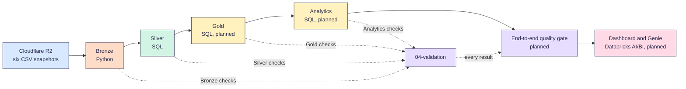

<p align="center">
  
</p>

# Infrastructure Project Monitoring

A Databricks pipeline for understanding Philippine public infrastructure investment.
It shows where funding is concentrated and which areas receive relatively less investment.

[](https://github.com/Buildabida/infra-project-monitoring/actions/workflows/checks.yml)

Team Buildabida built this project for the 2026 FTW Foundation Data Engineering Track capstone.

> [!NOTE]
> Bronze ingestion is implemented.
> Silver configuration, geography and population, DPWH project foundation,
> flood-list source reconciliation, project-region mapping, regional flood-exposure,
> and project-flood mapping outputs are implemented.
> The six Gold dimensions are implemented. The three Gold facts are implemented. Gold validation remains planned.

## Why we built it

Government project data is published across several sources.
Each source describes places and project types differently.
This makes the complete investment picture difficult to see.

Our brief asks one main question:

> Where is government infrastructure investment concentrated, and what types of projects are being funded?
> Which areas have relatively low investment compared with population and infrastructure needs?

In simple terms, we want to know where funding goes and what it supports.
We also compare investment with population and infrastructure-need indicators.

Five supporting questions guide the analysis.
We answer them at the regional level first ([D-25](docs/decisions.md)).

1. Which regions receive the highest and lowest reported infrastructure investment and project counts?
2. Which infrastructure categories receive the largest share of reported project budget, and how does flood-control compare to other categories?
3. Which regions and infrastructure categories have the highest percentage of ongoing, inactive, or long-running projects?
4. Which regions receive a larger or smaller share of infrastructure investment relative to their population share?
5. How does flood-control investment and project coverage compare with flood-risk exposure across Philippine regions?

## Who it is for

- **The TWG-IDI**, the Technical Working Group on Infrastructure Data Integration.
  The Senate Committee on Public Works asked for it.
  It helps the committee compare project investment by area and type when it reviews the budget ([D-27](docs/decisions.md)).
- **The public**, following where public works money goes in their region
- **Reviewers** verifying the pipeline, evidence, and analytical assumptions

## How it works



Each layer has its own checks.
The end-to-end quality gate reads every result before the dashboard.
A step starts only when the step before it has no blocking failure.
Databricks runs every step in the team workspace ([D-01](docs/decisions.md)).

Each layer is a schema in the `buildabida-capstone` catalog.
The numbers show the pipeline order.

| Schema | What it holds |
| --- | --- |
| `00-source` | Cloudflare R2 snapshots exposed through a Unity Catalog volume |
| `01-bronze` | Selected raw source snapshots with technical lineage |
| `02-silver` | Cleaned, standardized, reconciled, and geographically matched data |
| `03-gold` | Analytical facts and dimensions for the dashboard and Genie |
| `04-validation` | Data-quality and pipeline-validation results |
| `05-analytics` | Tables that answer our five questions, built from Gold. Planned. |
| `06-data-quality` | Data-quality work across the whole pipeline. Planned. |

`05-analytics` and `06-data-quality` exist in the team workspace.
The setup notebook does not create them yet.

Python preserves six selected source snapshots in `01-bronze`.
Grouped Spark checks write Bronze results to `04-validation`.
Silver configuration tables govern mapping decisions.

Implemented Silver outputs currently include:

- official PSGC place hierarchy
- Table C place-level reconciliation
- region-level population
- row-preserving DPWH project components
- canonical project-level consolidation with a governed DPWH
  `componentCategories` sector taxonomy
- row-preserving flood-control components
- exact Contract-ID source reconciliation
- governed project-to-region mapping with retained unresolved and conflict evidence
- regional MGB flood exposure calculated once in an equal-area CRS, with explicit no-data regions
- governed project-to-flood-susceptibility classification with retained no-match and ambiguous evidence

Silver validation checks row preservation, project accounting, and taxonomy
coverage for projects and reported budgets. It checks source reconciliation,
geographic precedence, budget protection, lineage, and retained source-quality
findings. It also checks flood-exposure area, CRS, and overlap.
For project-flood mapping, it independently recomputes every project's MGB candidates.

Gold dimensions and facts are implemented. Gold validation remains planned.
See the [Gold model](docs/gold_model.md).
Gold owns the analytical models used by the dashboard and Genie.

### Tools we use

| Tool | What it does for us |
| --- | --- |
| Cloudflare R2 | Keeps the raw source files and their snapshot history ([D-23](docs/decisions.md)) |
| [Databricks Free Edition](https://www.databricks.com/learn/free-edition) | Runs our notebooks on serverless compute. Unity Catalog holds the catalog, the schemas and the source volume. |
| Delta Lake | Stores every table. A load replaces a table in one step, so readers never see half a load. |
| Python and PySpark | Load the six sources into Bronze and run the Bronze checks ([D-08](docs/decisions.md)) |
| SQL | Builds Silver and runs its checks. Gold and analytics are planned in SQL too ([D-08](docs/decisions.md)). |
| GitHub | Holds the code, reviews, issues and the [project board](https://github.com/orgs/Buildabida/projects/1) ([D-06](docs/decisions.md), [D-09](docs/decisions.md)) |
| GitHub Actions | Runs five checks on every pull request: Ruff with pytest, SQLFluff, markdownlint, lychee and Vale |
| VS Code with the Databricks extension | Where we write code and send it to the team workspace ([D-11](docs/decisions.md)) |
| Databricks AI/BI dashboard and Genie | Planned. The dashboard and the question space for the TWG-IDI. |

### Main decisions

Every choice has a row in our [decisions log](docs/decisions.md), with its date and reason.

- **One team workspace** runs the final pipeline and dashboard (D-01).
- **DPWH is the one source for projects and budgets.** The flood list matches by exact Contract ID, and its cost is never added (D-04).
- **Python loads Bronze, and SQL owns the later layers** (D-08).
- **Cloudflare R2 keeps six approved snapshots.** Bronze holds the selected one and records its identity (D-23).
- **We start at the region level.** Province views come only where map coverage supports them (D-25).
- **The TWG-IDI is our main user**, and the public comes second (D-27).
- **We report listed budgets, not payments**, and we show data gaps first (D-28).
- **Every layer must survive a source update.** We keep the snapshot, run and version of every load (D-29).
- **Silver rules live in five versioned tables.** A rule works only after the team approves it (D-30).
- **Each project gets a region in a fixed order**, and unresolved projects stay visible (D-31).

## Quickstart

We write code in VS Code and use the shared [Databricks Free Edition](https://www.databricks.com/learn/free-edition) workspace.
Nadine manages workspace access.

1. Install VS Code with the **Databricks** and **Python** extensions.
2. Clone `https://github.com/Buildabida/infra-project-monitoring.git`.
   Open the cloned folder in VS Code.
3. Select the **Databricks** extension.
   Sign in with **OAuth (user to machine)** and choose **Serverless**.
4. Open `notebooks/00_setup/00_setup_workspace.sql`.
   Select **Run on Databricks**, then **Run File as Workflow**.

The final cell lists the schemas in the catalog.
Next, use `01_check_sources.py` to verify access to every configured source.
See [set up VS Code](docs/vscode-setup.md) for the full instructions.

Before loading Bronze, confirm that the six configured CSVs exist in this volume directory:

```text
/Volumes/buildabida-capstone/00-source/cloudflare-r2/buildabida/
```

Then use `notebooks/run_all.py`, the current Source-to-Bronze coordinator.
See [load Bronze](notebooks/README.md#load-bronze) for the complete workflow.

## Run the whole pipeline

Run the steps in this order.
If a blocking check fails, stop there. Fix the cause, then rerun that step.

1. **Set up.** Run `00_setup/00_setup_workspace.sql`, then `00_setup/01_check_sources.py`.
2. **Load and check Bronze.** Run `notebooks/run_all.py`.
   It loads the six sources, then runs `04_validation/01_validation_bronze.py`.
3. **Build and check Silver.** Run steps 11 to 26 in the [notebooks guide](notebooks/README.md#documented-sequence), then `02_silver/10_silver_project_flood_map` and `04_validation/08_validation_silver_project_flood_map`.
   Each Silver notebook is followed by its own check notebook.
4. **Build and check Gold.** Planned for Oct 10.
5. **Build and check analytics.** Planned, in `notebooks/05_analytics`.
6. **Run the end-to-end quality gate.** Planned. One failed check fails the whole run.
7. **Refresh the dashboard and Genie.** Planned for Oct 17.

Every built step is safe to run twice.
Bronze skips a snapshot it already holds.
Silver rebuilds each table with `CREATE OR REPLACE TABLE`.
There is no Databricks job in the repo yet.
Its settings go in `resources/` when we add it.

## Data sources

### Loaded Bronze sources

Bronze loads these six approved snapshots from Cloudflare R2:

| Source | What we use it for |
| --- | --- |
| [DPWH projects API](https://api.dpwh.bettergov.ph/projects) by BetterGov.ph | DPWH projects with reported budget, progress, dates, contractor, and map points. |
| [BetterGov flood-control projects](https://bettergov.ph/flood-control-projects/table) | Flood-control list named in the project brief. |
| [PSGC 2Q 2026](https://psa.gov.ph/classification/psgc) by PSA | Official geographic codes and place names. Population remains a cross-check for Table C. |
| [2024 Census of Population](https://psa.gov.ph/content/2024-census-population-popcen-population-counts-declared-official-president) by PSA | Table C provides the authoritative project population source. |
| [Boundary maps](https://github.com/bendlikeabamboo/barangay-boundaries-repository) with PSGC codes | Geographic reference data for matching project coordinates to places |
| [DENR MGB flood susceptibility](https://controlmap.mgb.gov.ph/arcgis/rest/services/GeospatialDataInventory/GDI_Detailed_Flood_Susceptibility/FeatureServer/0) | Flood-hazard context from the approved trimmed extract. Spatial matching remains downstream. |

### What each snapshot holds

| Bronze table | One row is | Rows | As of |
| --- | --- | ---: | --- |
| `dpwh_projects` | One exported project row | 265,661 | Not recorded yet |
| `flood_control_projects` | One flood-control feature. Repeated Contract IDs stay. | 9,861 | Not recorded yet |
| `psgc` | One official place | 43,768 | PSGC 2Q 2026 |
| `census_2024_table_c` | One Table C row, including the known BARMM copies | 43,750 | 2024 census |
| `boundaries` | One map shape | 43,760 | Not recorded yet |
| `flood_susceptibility` | One flood area from the trimmed MGB extract | 63,684 | Not recorded yet |
| **Total** | Six snapshots | **470,484** | Loaded Oct 4, 2026 |

All six snapshots were loaded and checked in Databricks on Oct 4, 2026.
The latest Bronze check run, on Oct 6, gave 106 PASS, 20 FLAG and 0 FAIL.
All 96 blocking checks passed.
The [Bronze evidence](docs/evidence/bronze-r2/README.md) lists each snapshot ID and result.

### Get the source files

Our Cloudflare R2 bucket is private to the team.
To rerun the pipeline in your own workspace:

1. Run `00_setup/00_setup_workspace.sql` to create the catalog and schemas.
2. Create a volume named `cloudflare-r2` in the `00-source` schema.
3. Download each source from its link in [loaded Bronze sources](#loaded-bronze-sources).
   Save it as a CSV with the file name below.
4. Upload the six CSVs to `/Volumes/buildabida-capstone/00-source/cloudflare-r2/buildabida/`.
5. Run `00_setup/01_check_sources.py`.
   It checks each file and its headers before any load.

| Source | File name | How we made our file |
| --- | --- | --- |
| DPWH projects | `dpwh_projects.csv` | Exported from the API JSON |
| Flood-control projects | `flood_control_projects.csv` | Exported from the ArcGIS JSON |
| PSGC | `psgc.csv` | Exported from the PSA workbook |
| Census Table C | `population_2024_table_c_test.csv` | Combined from the 18 regional workbooks |
| Boundary maps | `boundary_bettergov.csv` | Combined from seven GeoJSON files, without the special areas file ([D-17](docs/decisions.md)) |
| MGB flood susceptibility | `flood_susceptibility.csv` | A trimmed extract with only the fields we need ([D-23](docs/decisions.md)) |

The code reads only this folder path, so a regular Unity Catalog volume works.
Our export steps are not written down yet, so your files may not match our row counts.
The source check and the Bronze checks show any difference.
See [six sources and provenance](docs/bronze_r2_architecture.md#six-sources-and-provenance) for what each file can prove.

### Reference and spot-check sources

These sites support manual verification. They are not additional Bronze datasets.

| Source | What we use it for |
| --- | --- |
| [DPWH Transparency Portal](https://transparency.dpwh.gov.ph) | Official DPWH reference used for source spot-checks |
| [Sumbong sa Pangulo](https://sumbongsapangulo.ph) | DPWH flood-control project reference |

Table C is the authoritative population source.
PSGC population remains a cross-check.
See the [Bronze R2 architecture](docs/bronze_r2_architecture.md) for current CSV provenance limits.

Three important source rules apply:

- The API field `location.province` can contain a DPWH district office name.
  It is not always a PSGC province.
  Silver gives each project a region in a fixed order, with map points and boundaries as the last step ([D-31](docs/decisions.md)).
- One flood-control contract can have multiple legitimate rows.
  These can represent components or funding years.
  Bronze preserves them, and Silver handles their analytical interpretation.
- A project can appear in both project lists.
  Silver matches them by exact Contract ID to prevent double-counting ([D-04](docs/decisions.md)).

## Data problems and how we handle them

Bronze keeps every source row as it came.
Silver handles or flags each problem, and the checks write every result to `04-validation`.
See [data-quality checks](docs/validation.md) for each check.

| Problem | What we do | Where we check it |
| --- | --- | --- |
| The DPWH field `location.province` can hold a district office name, not a place. | Silver gives each project a region in the D-31 order. Projects that don't match stay unresolved. | `06_validation_silver_project_region_map` |
| 50,522 DPWH rows, about 1 in 5, have no map point. | We keep them. An exact region name can still place them. Coverage is reported, not hidden. | Bronze coordinate check and the region map coverage check |
| One region can have more than one name, like `Region IV-B` and `MIMAROPA`. | Only approved aliases in `config_place_name_alias` can join two names. None is approved yet, so these rows stay visible. | `02_validation_silver_config` and `06_validation_silver_project_region_map` |
| The flood list repeats some Contract IDs, 157 rows in Bronze. They are not copies. | Bronze keeps every row (D-19). Silver keeps one component per row and matches Contract IDs exactly. | `05_validation_silver_source_reconciliation` |
| The same budget could be counted twice. | Silver keeps one project per Contract ID. Different budgets are never added up. The flood list cost is never added to the DPWH budget. | `04_validation_silver_projects` and `05_validation_silver_source_reconciliation` |
| Some values don't parse: 1 start date, 16 completion dates, 6 amounts paid and 5 progress values. | Bronze keeps the raw text. Silver keeps the raw value next to a safe `TRY_CAST` value. Bad values are flagged, not fixed. | Bronze cast checks and `04_validation_silver_projects` |
| 17 DPWH rows show progress outside 0 to 100. | We keep them and flag them. | Bronze progress check and `04_validation_silver_projects` |
| Census Table C has no PSGC codes. | Silver matches each row to a PSGC place by its sheet and section, then by approved aliases. Unsure and unmatched rows stay visible. | `03_validation_silver_geography_population` |
| 1,838 MGB flood areas have no rating, and 1,815 have no shape. | We keep them. The checks count them as unrated without changing the source. | Bronze MGB checks, Oct 6 run |
| Four regions have no safe boundary shape. The 2023 shapes of Western Visayas, Central Visayas and BARMM no longer match today's regions, and Negros Island Region has no shape. | Flood exposure by region shows them as no data, not zero. | `07_validation_silver_region_flood_exposure` |
| Only 20,398 of 215,138 projects with a map point fall inside a mapped flood area, about 1 in 11. | We keep every project. A project outside every approved flood area gets no level, which never means low risk. We spot check places known to flood before question 5 uses it. | `08_validation_silver_project_flood_map` |
| Central Office projects have no place. | They stay in the data with no region. The planned Gold layer leaves them out of per person numbers. | `06_validation_silver_project_region_map` |
| Amount paid is 0 for every project. | We report the listed budget, not payments (D-28). | [Known limits](#known-limits) |
| BARMM data is limited in the source. | We show it as a gap before any result (D-28). | [Known limits](#known-limits) |

## Known limits

- **Current CSV provenance varies.**
  Several CSVs were derived from API JSON, XLSX, or GeoJSON.
  The repository does not prove that every export was lossless.
  The MGB file is an approved trimmed extract.
- **DPWH data contains gaps.**
  The September 29 checks found zero amount paid for every project.
  About one in five projects has no map point.
  BARMM project coverage is also limited by the source.
- **One workspace owns the final pipeline.**
  This follows [D-01](docs/decisions.md).
  The team limits unnecessary compute and shares code through this repository.
- **MGB missing ratings and geometry remain source-quality findings.**
  The October 6 reconciliation recognizes the official `VHF`, `HF`, `MF`,
  and `LF` severity codes and treats `No rating`, null, and blank ratings as
  missing or unrated during validation only. The final unknown-rating check
  reports zero unexpected values. The selected snapshot contains 1,838
  missing or unrated records, including 1,815 rows where both the rating and
  geometry are blank. These remain non-blocking findings for Silver handling,
  while Bronze preserves the original source values.
- **We report listed budgets, not payments.**
  Reported budgets and contract costs are not actual payments ([D-28](docs/decisions.md)).
- **Need means population and flood risk here.**
  These two measures don't cover every kind of infrastructure need.
- **We start at the region level.**
  About 81 percent of DPWH rows have a map point.
  Province views come only where coverage supports them ([D-25](docs/decisions.md)).
- **Results show patterns, not proof.**
  They describe differences between regions.
  They don't judge fairness or prove a cause.
- **Four sources have no recorded date yet.**
  The DPWH, flood list, boundary and MGB snapshots don't record when the publisher made them.
- **Few project points fall inside MGB flood polygons.**
  In the first project-flood run, 20,398 of 215,138 projects with usable
  coordinates received a flood level. Another 15 sit inside polygons of more
  than one level. Most of the rest fall outside every approved polygon.
  That is not evidence of low or zero flood risk.
  See [project flood mapping](docs/silver_project_flood_mapping.md#runtime-evidence).

## Find your way around

- **Run it:** [quickstart](#quickstart), [notebooks guide](notebooks/README.md), and [VS Code setup](docs/vscode-setup.md)
- **Look up a table:** the [data model](docs/data-model.md) is our data dictionary. It gives the grain, key and main columns of every table.
- **Look something up:** [validation](docs/validation.md), [Silver mappings](docs/silver_config_mappings.md), and [Silver geography and population](docs/silver_geography_population.md).
  Continue with [Silver project foundation](docs/silver_project_cleaning.md), [source reconciliation](docs/silver_source_reconciliation.md), [project-to-region mapping](docs/silver_project_region_mapping.md), [regional flood exposure](docs/silver_region_flood_exposure.md), [project flood mapping](docs/silver_project_flood_mapping.md), or the [style guide](docs/style-guide.md).
- **Review evidence:** [Bronze validation evidence](docs/evidence/bronze-r2/README.md)
- **See why we chose something:** [decisions](docs/decisions.md)
- **Contribute:** [how we work](CONTRIBUTING.md)

```text
.
├── README.md          this page
├── CONTRIBUTING.md    team workflow, reviews, and AI rules
├── LICENSE            MIT License for project code
├── notebooks/         Databricks notebooks organized by pipeline step
│   ├── 00_setup/         create the schemas and check the source files
│   ├── 01_bronze/        load the six sources
│   ├── 02_silver/        clean, match and map
│   ├── 04_validation/    checks for every layer
│   ├── 05_analytics/     answers to the five questions, planned
│   └── 06_data_quality/  data-quality work, planned
├── src/               shared Python modules and their current or legacy status
├── docs/              model, validation, evidence, decisions, and guides
├── dashboard/         dashboard artifacts
├── tests/             automated tests for shared code
├── resources/         Databricks job and bundle settings
├── assets/            repository images
├── databricks.yml     shared workspace configuration
└── .github/           issue forms, pull request forms, and checks
```

## Help out

Every change uses a pull request with one review.
Read [how we work](CONTRIBUTING.md) before contributing.

Our AI policy is AI-assisted and human-owned.
See [using AI tools](CONTRIBUTING.md#using-ai-tools) for the accountability rules.

## Team and timeline

Team members are Kinah, Bri, Nadine, Sam, and Tricia.
Carmi is the mentor, and Simonee is the support instructor.

| Date | Milestone |
| --- | --- |
| Oct 3 | Bronze ingestion and reviewed draft schema |
| Oct 10 | Silver and Gold tables with validation |
| Oct 17 | Dashboard, Genie, and Databricks Associate exam |
| Oct 24 | Final Capstone Showcase and graduation |

Tasks are tracked on the [project board](https://github.com/orgs/Buildabida/projects/1).

## License and credits

Project code uses the [MIT License](LICENSE).
Source data remains subject to each publisher's terms.
We thank DPWH, PSA, BetterGov.ph, OCHA HDX, and FTW Foundation.
