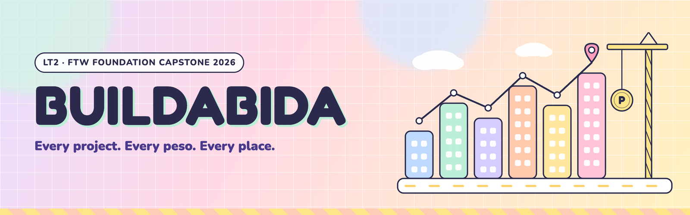
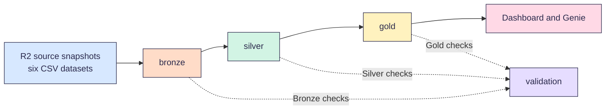

<p align="center">
  
</p>

# Infrastructure Project Monitoring

A Databricks pipeline for understanding Philippine public infrastructure investment.
It shows where funding is concentrated and which areas receive relatively less investment.

[](https://github.com/Buildabida/infra-project-monitoring/actions/workflows/checks.yml)

Team Buildabida built this project for the 2026 FTW Foundation Data Engineering Track capstone.

> [!NOTE]
> Bronze ingestion is implemented.
> Silver configuration plus geography and population, and DPWH project-foundation outputs are implemented.
> Other Silver outputs and Gold remain planned.

## Why we built it

Government project data is published across several sources.
Each source describes places and project types differently.
This makes the complete investment picture difficult to see.

Our brief asks one main question:

> Where is government infrastructure investment concentrated, and what types of projects are being funded?
> Which areas have relatively low investment compared with population and infrastructure needs?

In simple terms, we want to know where funding goes and what it supports.
We also compare investment with population and infrastructure-need indicators.

These supporting questions guide the analysis:

1. How much reported project budget goes to each region and province?
2. Which projects are ongoing, inactive, long-running, or showing no progress?
3. How do reported budget and physical progress compare?
4. How does flood-control investment compare with other project categories?
5. Which places have high population or flood exposure but relatively low reported investment?

## Who it is for

- **People** checking public works investment in their province or city
- **Planners** identifying places with high needs and relatively low investment
- **Reviewers** verifying the pipeline, evidence, and analytical assumptions

## How it works



Each layer is a schema in the `buildabida-capstone` catalog.
The numbers show the pipeline order.

| Schema | What it holds |
| --- | --- |
| `00-source` | Cloudflare R2 snapshots exposed through a Unity Catalog volume |
| `01-bronze` | Selected raw source snapshots with technical lineage |
| `02-silver` | Cleaned, standardized, reconciled, and geographically matched data |
| `03-gold` | Analytical facts and dimensions for the dashboard and Genie |
| `04-validation` | Data-quality and pipeline-validation results |

Python preserves six selected source snapshots in `01-bronze`.
Grouped Spark checks write Bronze results to `04-validation`.
Silver configuration tables govern mapping decisions.

Implemented Silver outputs currently include:

- official PSGC place hierarchy
- Table C place-level reconciliation
- region-level population
- row-preserving DPWH project components
- canonical project-level consolidation

Silver project validation checks row preservation, project accounting, budget protection, lineage, and retained source-quality findings.

Flood-control reconciliation, project-region mapping, project-flood mapping, and Gold analytical models remain planned.
Gold owns the analytical models used by the dashboard and Genie.

## Quickstart

We write code in VS Code and use the shared [Databricks Free Edition](https://www.databricks.com/learn/free-edition) workspace.
Nadine manages workspace access.

1. Install VS Code with the **Databricks** and **Python** extensions.
2. Clone `https://github.com/Buildabida/infra-project-monitoring.git`.
   Open the cloned folder in VS Code.
3. Select the **Databricks** extension.
   Sign in with **OAuth (user to machine)** and choose **Serverless**.
4. Open `notebooks/00_setup/00_setup_workspace.sql`.
   Select **Run on Databricks**, then **Run File as Workflow**.

The final cell lists the five project schemas.
Next, use `01_check_sources.py` to verify access to every configured source.
See [set up VS Code](docs/vscode-setup.md) for the full instructions.

Before loading Bronze, confirm that the six configured CSVs exist in this volume directory:

```text
/Volumes/buildabida-capstone/00-source/cloudflare-r2/buildabida/
```

Then use `notebooks/run_all.py`, the current Source-to-Bronze coordinator.
See [load Bronze](notebooks/README.md#load-bronze) for the complete workflow.

## Data sources

### Loaded Bronze sources

Bronze loads these six approved snapshots from Cloudflare R2:

| Source | What we use it for |
| --- | --- |
| [DPWH projects API](https://api.dpwh.bettergov.ph/projects) by BetterGov.ph | DPWH projects with reported budget, progress, dates, contractor, and map points. The selected snapshot contains 265,661 rows. |
| [BetterGov flood-control projects](https://bettergov.ph/flood-control-projects/table) | Flood-control list named in the project brief. The selected snapshot contains 9,861 rows. |
| [PSGC 2Q 2026](https://psa.gov.ph/classification/psgc) by PSA | Official geographic codes and place names. Population remains a cross-check for Table C. |
| [2024 Census of Population](https://psa.gov.ph/content/2024-census-population-popcen-population-counts-declared-official-president) by PSA | Table C provides the authoritative project population source. |
| [Boundary maps](https://github.com/bendlikeabamboo/barangay-boundaries-repository) with PSGC codes | Geographic reference data for matching project coordinates to places |
| [DENR MGB flood susceptibility](https://controlmap.mgb.gov.ph/arcgis/rest/services/GeospatialDataInventory/GDI_Detailed_Flood_Susceptibility/FeatureServer/0) | Flood-hazard context from the approved trimmed extract. Spatial matching remains downstream. |

### Reference and spot-check sources

These sites support manual verification. They are not additional Bronze datasets.

| Source | What we use it for |
| --- | --- |
| [DPWH Transparency Portal](https://transparency.dpwh.gov.ph) | Official DPWH reference used for source spot-checks |
| [Sumbong sa Pangulo](https://sumbongsapangulo.ph) | DPWH flood-control project reference |

Table C is the authoritative population source.
PSGC population remains a cross-check.
See the [Bronze R2 architecture](docs/bronze_r2_architecture.md) for current CSV provenance limits.

Three important source rules apply:

- The API field `location.province` can contain a DPWH district office name.
  It is not always a PSGC province.
  Silver uses map points and boundaries to identify the geographic area.
- One flood-control contract can have multiple legitimate rows.
  These can represent components or funding years.
  Bronze preserves them, and Silver handles their analytical interpretation.
- A project can appear in both project lists.
  Silver matches records using approved rules to prevent double-counting.

## Known limits

- **Current CSV provenance varies.**
  Several CSVs were derived from API JSON, XLSX, or GeoJSON.
  The repository does not prove that every export was lossless.
  The MGB file is an approved trimmed extract.
- **DPWH data contains gaps.**
  The September 29 checks found zero amount paid for every project.
  About one in five projects has no map point.
  BARMM project coverage is also limited by the source.
- **One workspace owns the final pipeline.**
  This follows [D-01](docs/decisions.md).
  The team limits unnecessary compute and shares code through this repository.
- **MGB missing ratings and geometry remain source-quality findings.**
  The October 6 reconciliation recognizes the official `VHF`, `HF`, `MF`,
  and `LF` severity codes and treats `No rating`, null, and blank ratings as
  missing or unrated during validation only. The final unknown-rating check
  reports zero unexpected values. The selected snapshot contains 1,838
  missing or unrated records, including 1,815 rows where both the rating and
  geometry are blank. These remain non-blocking findings for Silver handling,
  while Bronze preserves the original source values.

## Find your way around

- **Run it:** [quickstart](#quickstart), [notebooks guide](notebooks/README.md), and [VS Code setup](docs/vscode-setup.md)
- **Look something up:** [data model](docs/data-model.md), [validation](docs/validation.md), [Silver mappings](docs/silver_config_mappings.md), [Silver geography and population](docs/silver_geography_population.md), and [style guide](docs/style-guide.md)
- **Review evidence:** [Bronze validation evidence](docs/evidence/bronze-r2/README.md)
- **See why we chose something:** [decisions](docs/decisions.md)
- **Contribute:** [how we work](CONTRIBUTING.md)

```text
.
├── README.md          this page
├── CONTRIBUTING.md    team workflow, reviews, and AI rules
├── LICENSE            MIT License for project code
├── notebooks/         Databricks notebooks organized by pipeline step
├── src/               shared Python modules and their current or legacy status
├── docs/              model, validation, evidence, decisions, and guides
├── dashboard/         dashboard artifacts
├── tests/             automated tests for shared code
├── resources/         Databricks job and bundle settings
├── assets/            repository images
├── databricks.yml     shared workspace configuration
└── .github/           issue forms, pull request forms, and checks
```

## Help out

Every change uses a pull request with one review.
Read [how we work](CONTRIBUTING.md) before contributing.

Our AI policy is AI-assisted and human-owned.
See [using AI tools](CONTRIBUTING.md#using-ai-tools) for the accountability rules.

## Team and timeline

Team members are Kinah, Bri, Nadine, Sam, and Tricia.
Carmi is the mentor, and Simonee is the support instructor.

| Date | Milestone |
| --- | --- |
| Oct 3 | Bronze ingestion and reviewed draft schema |
| Oct 10 | Silver and Gold tables with validation |
| Oct 17 | Dashboard, Genie, and Databricks Associate exam |
| Oct 24 | Final Capstone Showcase and graduation |

Tasks are tracked on the [project board](https://github.com/orgs/Buildabida/projects/1).

## License and credits

Project code uses the [MIT License](LICENSE).
Source data remains subject to each publisher's terms.
We thank DPWH, PSA, BetterGov.ph, OCHA HDX, and FTW Foundation.
