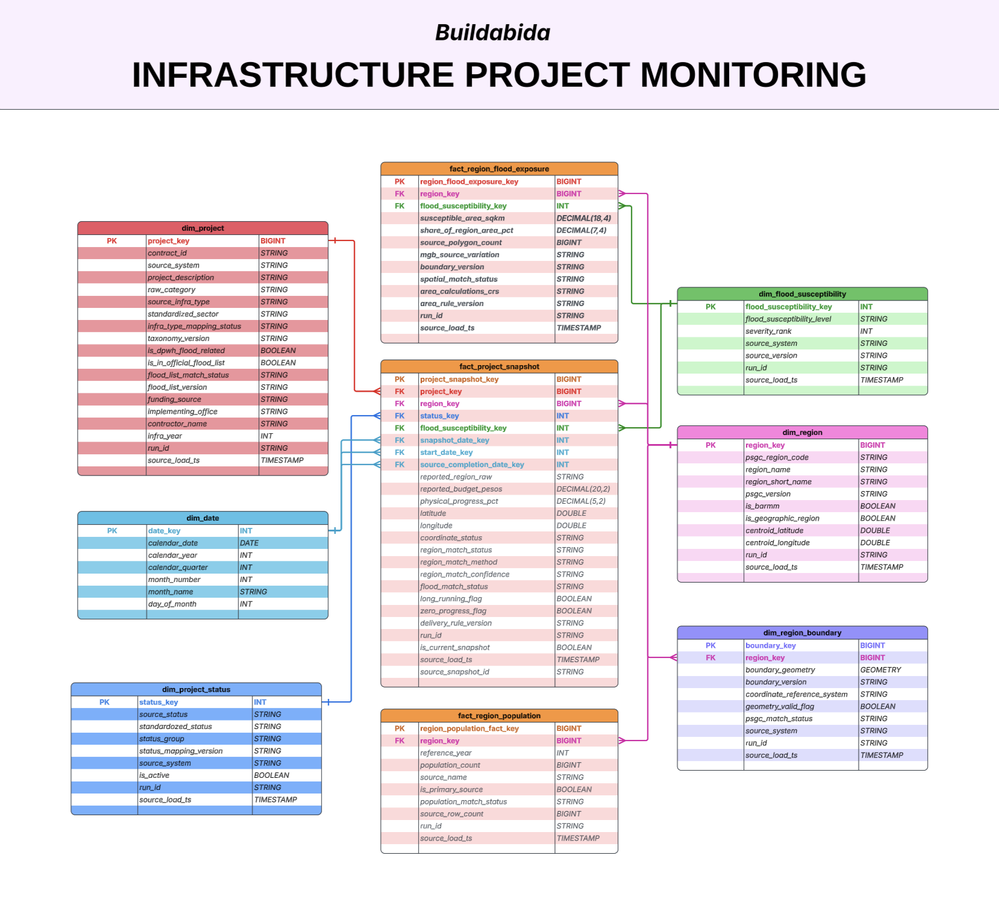

# Data model

Every table lives in the `buildabida-capstone` catalog.
Bronze preserves one selected source snapshot.
Silver owns cleaning, reconciliation, matching, and mapping.
Gold contains the facts and dimensions used to answer the project questions.

## Implementation status

| Layer | Status | Meaning |
| --- | --- | --- |
| Bronze | Implemented | The six source tables, `load_log`, and Bronze validation results exist. |
| Silver | Planned | The tables below define the intended contracts. They are not implemented yet. |
| Gold | Planned | The facts and dimensions below are design targets. They are not implemented yet. |

```text
R2 source snapshots → Bronze → Silver matching and reconciliation → Gold facts/dimensions
                      ↓                    ↓                         ↓
                 04-validation shared results for Bronze, Silver, and Gold
```

## Planned constellation model

The regional MVP uses three fact tables with shared dimensions.
This fact constellation answers the five approved analytical questions.



The current Gold design is regional.
Province and municipality drilldowns remain future extensions.
They require sufficient geographic match coverage before publication.

## Bronze source contracts (implemented)

| Table | One row is | Source-grain identity |
| --- | --- | --- |
| `01-bronze.dpwh_projects` | One exported DPWH project row | Contract or project identifier |
| `01-bronze.flood_control_projects` | One exported flood-control feature. Repeated Contract IDs remain. | Source object identifier |
| `01-bronze.psgc` | One exported PSGC place row | PSGC code |
| `01-bronze.census_2024_table_c` | One exported Table C row, including known BARMM copies | Source file, sheet, and row |
| `01-bronze.boundaries` | One exported geographic shape row | Source file and feature identifier |
| `01-bronze.flood_susceptibility` | One flood area in the approved trimmed MGB extract | Source row. No key is invented. |
| `01-bronze.load_log` | One ingestion status event | `run_id`, `status` |
| `04-validation.dq_results` | One data-quality check in one validation run | `run_id`, `table_name`, `column`, `data_quality_check` |

The implemented result schema is Bronze-only. Before Silver or Gold writes to the shared
validation schema, add a pipeline batch identifier and source layer. Retain the source,
mapping, and taxonomy versions needed to reproduce each downstream check.

Census Table C is the authoritative population source.
PSGC population remains a cross-check.
There is no authoritative generic `01-bronze.population_2024` table.

Every business-source Bronze table adds these technical fields:

- `_source_system`
- `_source_path`
- `_source_file`
- `_source_format`
- `_source_snapshot_id`
- `_ingest_run_id`
- `_ingested_at`
- `_source_file_size_bytes`
- `_source_modified_ns`
- `_source_modified_at`

An optional publisher `source_version` is stored in `load_log`.
Silver must carry it through `_ingest_run_id` when a target requires a source version.
This applies to PSGC, boundary, MGB, and flood-list versions.

Business columns remain source strings.
Only the minimum column-name substitutions required by Delta are permitted.
`load_log.column_mapping_json` records those changes.

## Silver matching and reconciliation tables (planned)

These tables preserve explainable matching decisions.
The Gold model must not hide those decisions.
They describe the target design and do not claim that the tables already exist.

| Table | Grain | Primary key | Main columns |
| --- | --- | --- | --- |
| `02-silver.silver_dpwh_project_component` | One DPWH component or type-of-work record per contract and ingestion run | `component_key` | `source_system`, `contract_id`, `source_component_id`, `source_infra_type`, `source_type_of_work`, `component_description`, `source_row_number`, `run_id`, `source_load_ts` |
| `02-silver.silver_flood_control_component` | One published flood-control source row | `flood_component_key` | `source_contract_id`, matched project system and contract, `type_of_work`, `component_description`, `source_contract_cost`, `match_status`, `source_row_number`, `source_version`, `run_id`, `source_load_ts` |
| `02-silver.silver_project_region_map` | One project-to-region mapping result per pipeline run | `project_region_map_key` | `source_system`, `contract_id`, `psgc_region_code`, `reported_region_raw`, `mapping_method`, `match_status`, `match_quality`, `boundary_version`, `run_id`, `source_load_ts` |
| `02-silver.silver_project_flood_map` | One final project-to-flood classification per pipeline run | `project_flood_map_key` | `source_system`, `contract_id`, `flood_susceptibility_level`, `severity_rank`, `match_status`, `matched_polygon_count`, `classification_rule`, `mgb_source_version`, `run_id`, `source_load_ts` |
| `02-silver.silver_population_region_reconciliation` | One population source-row reconciliation result per pipeline run | `population_reconciliation_key` | `source_name`, `source_row_number`, `source_sheet`, `source_place_name`, `matched_psgc_code`, `match_status`, `match_method`, `ambiguity_reason`, `is_duplicate_sheet_row`, `is_primary_population_record`, `run_id`, `source_load_ts` |
| `02-silver.config_project_category_mapping` | One approved source category mapping per taxonomy version | Composite natural key | `source_system`, `raw_category`, `source_infra_type`, `standardized_sector`, `mapping_rule`, `taxonomy_version`, approval fields |

Required Silver uniqueness:

- Project-region and project-flood maps: `source_system`, `contract_id`, `run_id`.
- DPWH components: `source_system`, `contract_id`, `source_component_id`, `run_id`.
- Use `source_row_number` when no stable component ID exists.
- Flood-control components: `source_contract_id`, `source_row_number`, `source_version`, `run_id`.
- Population reconciliation: `source_name`, `source_sheet`, `source_row_number`, `run_id`.
- Category mapping: `source_system`, `raw_category`, `source_infra_type`, `taxonomy_version`.

## Gold fact tables (planned)

These fact tables are design targets and do not exist yet.

### `03-gold.fact_project_snapshot`

Grain: one DPWH project per distinct source snapshot.

Primary key: `project_snapshot_key`.

Foreign keys:

- `project_key`
- `region_key`
- `status_key`
- `flood_susceptibility_key`
- `snapshot_date_key`
- `start_date_key`
- `source_completion_date_key`

Main measures and lineage:

- `reported_budget_pesos DECIMAL(20,2)`.
- `physical_progress_pct DECIMAL(5,2)`.
- `latitude DOUBLE`, `longitude DOUBLE`, and coordinate or match status fields.
- `long_running_flag`, `zero_progress_flag`, and `delivery_rule_version`.
- `source_snapshot_id`, `run_id`, `is_current_snapshot`, and `source_load_ts`.

Uniqueness: `project_key`, `source_snapshot_id`.

### `03-gold.fact_region_population`

Grain: one region per population reference year and source.

Primary key: `region_population_fact_key`.
Foreign key: `region_key`.

Main columns:

- `reference_year`
- `population_count`
- `source_name`
- `is_primary_source`
- `population_match_status`
- `source_row_count`
- `run_id`
- `source_load_ts`

Uniqueness: `region_key`, `reference_year`, `source_name`.

### `03-gold.fact_region_flood_exposure`

Grain: one region per susceptibility level, MGB version, and boundary version.

Primary key: `region_flood_exposure_key`.
Foreign keys: `region_key` and `flood_susceptibility_key`.

Measures and lineage:

- `susceptible_area_sqkm`
- `share_of_region_area_pct`
- `source_polygon_count`
- `mgb_source_version`
- `boundary_version`
- `spatial_match_status`
- `area_calculation_crs`
- `area_rule_version`
- `run_id`
- `source_load_ts`

Uniqueness includes these fields:

- `region_key`
- `flood_susceptibility_key`
- `mgb_source_version`
- `boundary_version`

## Gold dimensions (planned)

These dimensions are design targets and do not exist yet.

| Dimension | Grain and key | Main columns |
| --- | --- | --- |
| `03-gold.dim_date` | One row per calendar date. Key: `date_key`. | `calendar_date`, year, quarter, month, and day fields |
| `03-gold.dim_project` | One unique contract per source system. Key: `project_key`. | `contract_id`, descriptions, categories, standardized sector, mapping details, flood-list details, funding source, office, contractor, infrastructure year, lineage |
| `03-gold.dim_region` | One official PSGC region per PSGC version plus key `0`. Key: `region_key`. | PSGC code, names, version, BARMM and geographic flags, centroid, lineage |
| `03-gold.dim_project_status` | One source-status mapping per version. Key: `status_key`. | Source and standardized status, group, mapping version, source system, active flag, lineage |
| `03-gold.dim_flood_susceptibility` | One susceptibility classification per source version. Key: `flood_susceptibility_key`. | Level, severity rank, source system, source version, lineage |
| `03-gold.dim_region_boundary` | One boundary version per official region. Key: `boundary_key`. | `region_key`, geometry, version, CRS, validity, PSGC-match status, source system, lineage |

Dimension uniqueness:

- `dim_date`: `calendar_date`.
- `dim_project`: `source_system`, `contract_id`.
- `dim_region`: `psgc_region_code`, `psgc_version`.
- `dim_project_status`: `source_system`, `source_status`, `status_mapping_version`.
- `dim_flood_susceptibility`: `source_system`, `flood_susceptibility_level`, `source_version`.
- `dim_region_boundary`: `region_key`, `boundary_version`.

## Six-source lineage

| Source | Downstream destination |
| --- | --- |
| DPWH projects | DPWH component mapping, category mapping, project and status dimensions, and project snapshot fact |
| Flood-control list | Flood-control components and official flood-list flags on projects |
| PSGC | Region dimension and population reconciliation |
| PSA Table C | Population reconciliation and region population fact |
| BetterGov boundaries | Region boundary dimension, project-region mapping, and regional flood intersection |
| MGB flood susceptibility | Project-flood mapping, susceptibility dimension, and region flood-exposure fact |

## Join rules

- `fact_project_snapshot.project_key` joins to `dim_project.project_key`.
- `fact_project_snapshot.region_key` joins to `dim_region.region_key`.
- Status, susceptibility, and date keys join to their corresponding dimensions.
- Population and flood-exposure facts join to `dim_region` through `region_key`.
- Silver mapping tables retain the run, method, quality, and source version for every Gold key.
- Facts meet through conformed dimensions. Dashboard queries do not join facts directly at row level.
- Silver reconciles component rows before publishing one project snapshot row to Gold.
- Matched DPWH and flood-control records must not create a second project or duplicate its budget.
- Key `0` is reserved for unknown, unmapped, or non-geographic records.
  Central Office uses key `0` with `region_match_status = 'Non-geographic reporting unit'`.

## Required analytical validation (planned)

Apply these checks when the corresponding Silver and Gold tables are implemented.

1. At most one `is_current_snapshot = true` row exists per `project_key`.
2. Physical progress is between 0 and 100 or null.
3. Reported budget is non-negative or null.
4. Flood-exposure area is non-negative. Its regional share is between 0 and 100.
5. Primary population is positive. Each region and year has exactly one primary source.
6. Central Office is excluded from population-based ratios.
7. MGB classifications include Unknown, Low, Moderate, High, and Very High.
8. Severity rank is unique within each source system and version.
9. `source_snapshot_id` is not null. All fact foreign keys resolve.
10. Spatial areas use an appropriate projected CRS instead of square degrees.
11. Gold project counts and reported budgets reconcile with the approved Silver project grain.
12. A matched flood-control record does not duplicate a DPWH project or its reported budget.
13. Regional outputs report matched, unmatched, ambiguous, and non-geographic coverage.
14. Flood-area overlap and unclassified area remain visible in regional coverage results.

## Business-question coverage (planned)

| Analytical question | Measures | Main tables | Interpretation boundary |
| --- | --- | --- | --- |
| Which regions receive the highest and lowest reported investment and project counts? | Total reported budget, project count, and average project budget | `fact_project_snapshot`, `dim_region` | Show coordinate and match coverage. Do not interpret BARMM `No Data` as the lowest investment. |
| Which infrastructure categories receive the largest share of reported project budget? | Budget share, project count, and average project budget by category | `fact_project_snapshot`, `dim_project` | Use approved, versioned category mappings. Keep unmapped categories visible. |
| Which regions and categories have the highest percentage of ongoing, inactive, long-running, or stalled projects? | Percentage ongoing, inactive, long-running, and stalled | Project fact plus status, date, project, and region dimensions | Long-running means more than two years from the start date. Stalled means ongoing with zero physical progress. Do not claim delay without a reliable target date. |
| Which regions receive a larger or smaller investment share relative to population share? | Regional budget share, population share, and their ratio | Project fact, `fact_region_population`, and `dim_region` | Describe allocation differences, not fairness. Exclude non-geographic Central Office. |
| How do flood-control investment and project coverage compare with regional flood-risk exposure? | Flood-risk exposure, project count, reported budget, budget per resident, and regional budget share | Project, flood-exposure, population, susceptibility, and region tables | Report comparative patterns. Do not claim proof of sufficient or insufficient flood protection. |

## Measure definitions

- **Total reported budget:** sum one reconciled reported budget per project snapshot.
- **Project count:** count distinct `project_snapshot_key` values.
- **Average project budget:** divide total reported budget by distinct project count.
- **Budget share:** divide a region or category budget by the corresponding mapped total.
- **Ongoing or inactive percentage:** divide the matching project count by the stated project denominator.
- **Long-running percentage:** use projects more than two years from start date to snapshot date.
- **Stalled percentage:** use ongoing projects with physical progress equal to zero.
- **Population share:** use the primary Table C population for the same reference year.
- **Allocation ratio:** divide regional budget share by regional population share.
- **Flood-control budget per resident:** divide regional flood-control reported budget by primary population.

`physical_progress_pct` and `share_of_region_area_pct` are non-additive.
Dashboard queries must not sum either percentage.

Regional ratios exclude `region_key = 0` from their denominators.
The dashboard still reports unmatched and non-geographic project counts and budgets.

## Regional MVP scope

The current model publishes region-level rankings and comparisons.
NCR remains a distinct region and requires separate interpretation.
Province and municipality drilldowns are not part of this model version.
Add them only after Silver demonstrates sufficient match coverage at those levels.

The available need proxies are population and flood-risk exposure.
They do not represent every form of infrastructure need.
Reported budgets and contract costs are not actual payments or disbursements.

## Bronze preservation boundary

Bronze does not clean names, cast business types, map places, or deduplicate source rows.
It does not standardize categories, calculate measures, or perform spatial joins.
These decisions begin in Silver and remain traceable.
Traceability uses snapshot IDs, run IDs, mapping statuses, rule versions, and source versions.
