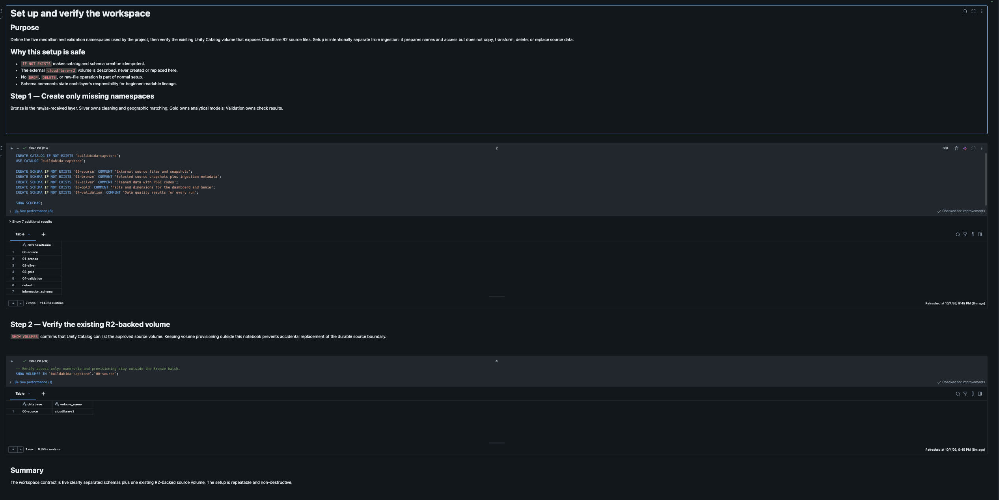
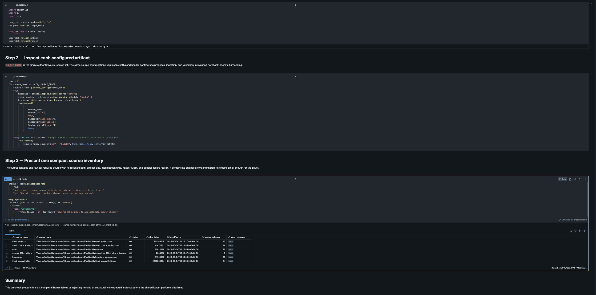
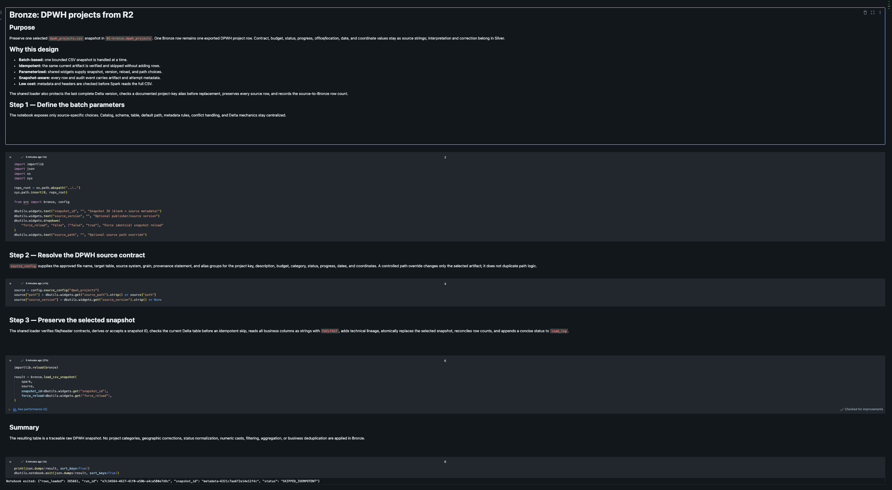
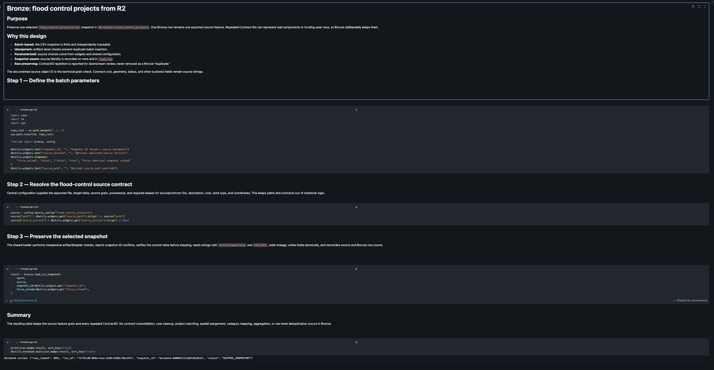
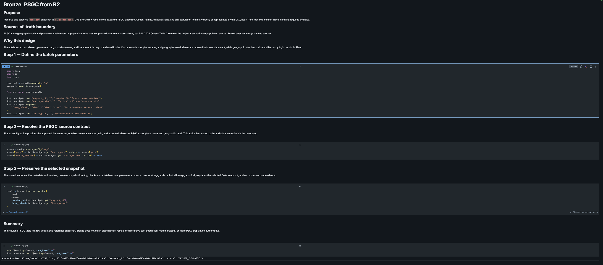
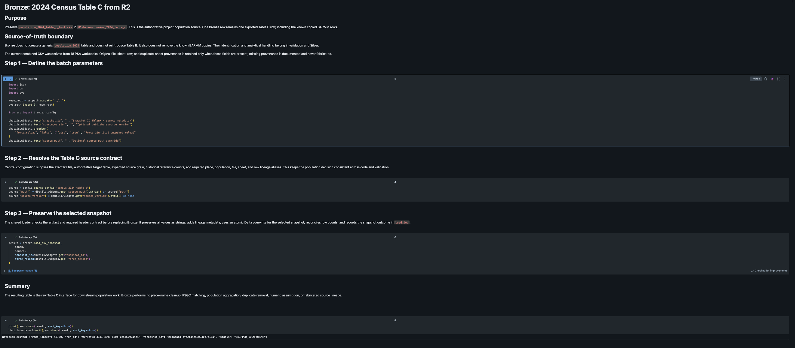
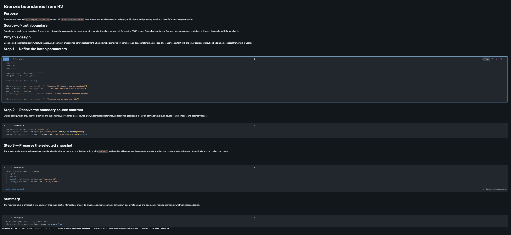
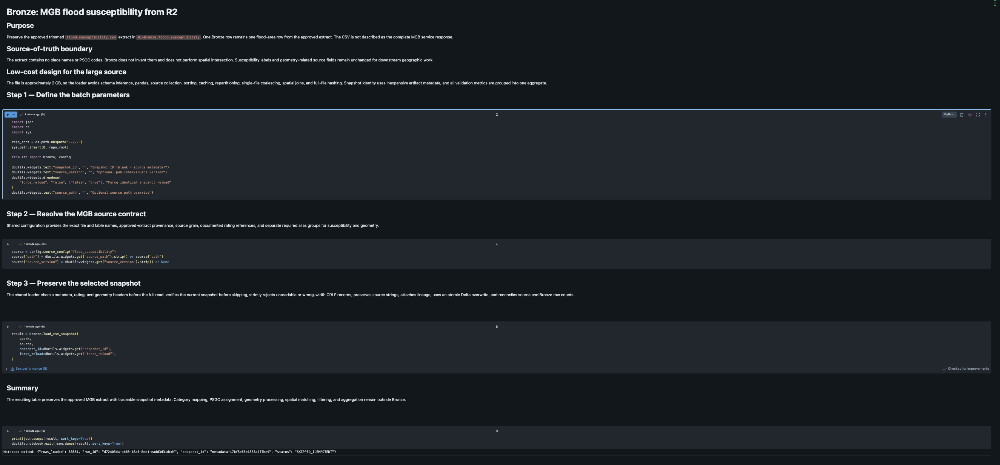
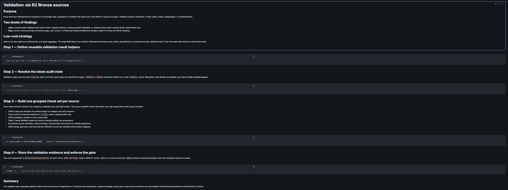

# Bronze R2 ingestion validation evidence

## Scope

This report records Databricks evidence for the six-source Bronze ingestion
from the approved Cloudflare R2 volume. It covers workspace setup, source
prechecks, per-source snapshot loading, idempotent reruns, grouped data-quality
validation, and the corrective changes made after validation gates identified
source-contract and source-quality findings.

The evidence was captured on October 4, 2026 in the
`buildabida-capstone` Unity Catalog. The exported validation result has run ID
`732b92cd-496e-4386-94ce-befbb5f06bdf` and timestamp
`2026-10-04T14:12:42.759Z` (`2026-10-04 22:12:42.759` Asia/Manila).

## Outcome

- The workspace setup confirmed the five project schemas and the existing
  `00-source.cloudflare-r2` volume.
- The source precheck returned `OK` for all six configured CSV artifacts.
- All six Bronze notebooks completed for their selected snapshots.
- The captured reruns returned `SKIPPED_IDEMPOTENT`, with the expected Bronze
  row count retained for every source.
- The grouped validation export contains 126 checks: 105 `PASS`, 21 `FLAG`,
  zero `FAIL`, and zero `ERROR`.
- All 96 checks configured with blocking action `stop` passed.
- Validation flags remain visible for review. They do not remove, deduplicate,
  correct, or rewrite Bronze rows.

The complete machine-readable result is in
[`validation-results.csv`](validation-results.csv).

## Selected snapshots

| Bronze table | Rows | Snapshot ID | Rerun status | Validation |
| --- | ---: | --- | --- | --- |
| `dpwh_projects` | 265,661 | `metadata-6321c7aa6f2a14e12f4c` | `SKIPPED_IDEMPOTENT` | 17 PASS, 8 FLAG |
| `flood_control_projects` | 9,861 | `metadata-0d088311118dfd63d63a` | `SKIPPED_IDEMPOTENT` | 20 PASS, 2 FLAG |
| `psgc` | 43,768 | `metadata-9f97e93e082df80535d6` | `SKIPPED_IDEMPOTENT` | 18 PASS, 0 FLAG |
| `census_2024_table_c` | 43,750 | `metadata-afa2fa4c580930b7c10a` | `SKIPPED_IDEMPOTENT` | 17 PASS, 3 FLAG |
| `boundaries` | 43,760 | `metadata-50c107fb3be0785f3a48` | `SKIPPED_IDEMPOTENT` | 17 PASS, 1 FLAG |
| `flood_susceptibility` | 63,684 | `metadata-17bf5e65e1838a2f7be9` | `SKIPPED_IDEMPOTENT` | 16 PASS, 7 FLAG |
| **Total** | **470,484** | Six selected snapshots | Six safe skips | **105 PASS, 21 FLAG** |

For every table, the validation export confirms:

- at least one row exists;
- exactly one selected snapshot is present;
- required ingestion metadata is populated;
- the current Bronze row count matches `load_log`;
- the current Bronze snapshot matches `load_log`; and
- the latest audit status is `SUCCESS` or `SKIPPED_IDEMPOTENT`.

## Corrective changes recorded during validation

### 1. DPWH reported-budget source contract

The initial source precheck stopped with:

```text
dpwh_projects /Volumes/buildabida-capstone/00-source/cloudflare-r2/buildabida/dpwh_projects.csv FAILED null - null Required source field groups are missing: reported budget (one of: budget, project_cost, projectCost)
```

The CSV header uses `reported_budget`. The DPWH `required_column_groups`
configuration accepted `budget`, `project_cost`, and `projectCost`, but did not
accept the actual header.

The configuration was corrected by adding `reported_budget` to the accepted
aliases for the reported-budget field group. The precheck gate itself was not
weakened. It continued to reject missing source contracts and then returned
`OK` for all six artifacts after the alias correction.

### 2. Known source imperfections were separated from blocking safety checks

The grouped validator initially stopped with:

```text
RuntimeError: 3 checks blocked the run: dpwh_projects / source-grain key is unique (FAIL); boundaries / source file/feature lineage is unique (FAIL); flood_susceptibility / flood-area geometry is not null or empty (FAIL)
```

These checks were changed from blocking action `stop` to review action `flag`.
The conditions remain measured and exported; only their pipeline action
changed. Bronze continues to preserve the source rows for downstream review.

| Source | Check | Finding | Share | Action |
| --- | --- | ---: | ---: | --- |
| `dpwh_projects` | Duplicate `contract_id` groups | 5 | 0.0019% of 265,661 rows | `stop` to `flag` |
| `boundaries` | Duplicate source file and feature lineage | 232 | 0.53% of 43,760 rows | `stop` to `flag` |
| `flood_susceptibility` | Null or empty geometry | 1,815 | 2.85% of 63,684 rows | `stop` to `flag` |

This severity change does not classify the affected values as correct. It
keeps them visible for Silver-layer handling while reserving blocking failures
for conditions that make the Bronze snapshot unsafe or untraceable.

## Validation flags

The following non-blocking findings are present in the exported result.

### DPWH projects

| Check | Finding |
| --- | ---: |
| Physical progress outside 0 to 100 | 17 rows |
| Missing project coordinate pair | 50,522 rows |
| Duplicate source-grain `contract_id` groups | 5 groups |
| Undocumented status category | 105 rows |
| `start_date` does not cast to `DATE` | 1 row |
| `completion_date` does not cast to `DATE` | 16 rows |
| `amount_paid` does not cast to `DECIMAL(38, 6)` | 6 rows |
| `progress` does not cast to `DOUBLE` | 5 rows |

### Flood-control projects

| Check | Finding |
| --- | ---: |
| Contract cost does not cast to a number | 2 rows |
| Repeated Contract IDs retained for Silver review | 157 rows |

### Census Table C

| Check | Finding |
| --- | ---: |
| Documented BARMM duplicate marker is unavailable | 1 check |
| Non-positive population when present | 12 rows |
| Difference from the 45,611-row historical reference | 1,861 rows |

The selected CSV contains 43,750 rows. The difference from the historical
reference is reported rather than repaired in Bronze.

### Boundaries

| Check | Finding |
| --- | ---: |
| Duplicate source-file and feature lineage | 232 rows |

### MGB flood susceptibility

| Check | Finding |
| --- | ---: |
| Null or empty geometry | 1,815 rows |
| Values outside accepted text rating labels | 61,862 rows |
| High reference-count difference | 15,111 rows |
| Low reference-count difference | 17,092 rows |
| Moderate reference-count difference | 25,302 rows |
| Very-high reference-count difference | 6,156 rows |
| Missing-rating reference-count difference | 1,799 rows |

The five documented reference counts total 63,684, which exactly matches the
selected MGB snapshot row count. At the same time, the validator flags nearly
all populated `flood_susceptibility_code` values against text labels. This
pattern indicates that the rating validator and the coded source values use
different representations. The code-to-label contract must be reconciled
before the MGB category-distribution checks are described as passing. This is
a validation-interpretation follow-up; Bronze values should remain unchanged.

### PSGC

No validation flags were recorded.

## Design evidence

| Requirement | Evidence |
| --- | --- |
| Batch-based | Each notebook selects one bounded CSV snapshot and invokes the shared loader once. |
| Idempotent | All six captured reruns returned `SKIPPED_IDEMPOTENT` and retained their row counts. |
| Parameterized | The notebooks expose snapshot ID, source version, force reload, and optional source-path widgets. |
| Snapshot-aware | Every table contains one snapshot ID, and table metadata reconciles with `load_log`. |
| Raw-preserving | Source-quality findings remain as flags; validation does not filter, correct, or deduplicate Bronze. |
| Low-cost | Source metadata and headers are checked before full reads, and validation metrics are grouped by source. |
| Resilient | Missing source contracts and blocking safety failures stop the workflow with specific diagnostics. |
| Traceable | Rows carry ingestion metadata, snapshot IDs, run IDs, source metadata, and matching load-log evidence. |

## Evidence images

### Workspace setup



### Six-source precheck



### DPWH projects



### Flood-control projects



### PSGC



### Census Table C



### Boundaries



### MGB flood susceptibility



### Grouped Bronze validation



## Acceptance note

The evidence supports successful setup, six-source availability, snapshot
loading, table-to-audit reconciliation, and safe same-snapshot reruns. It also
shows that every blocking safety check passed.

The result should be described as **completed with non-blocking findings**, not
as “all data-quality checks passed.” Before closing the MGB category-validation
acceptance item, reconcile the numeric or coded susceptibility values with the
documented text rating labels and capture the resulting check output.

